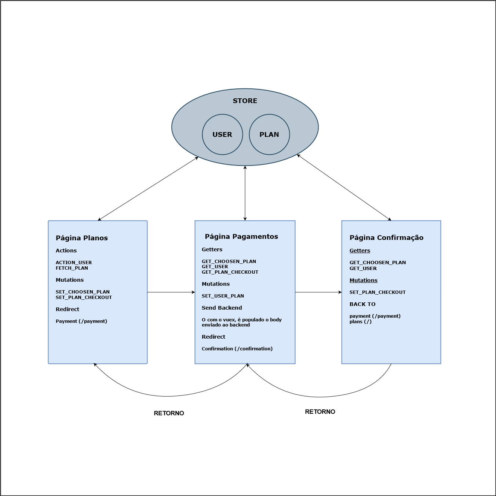

# pebmed-test

> A Vue 3 project

## Instalação

A instalação é bem simples, utilizando o gerenciador [npm](https://www.npmjs.com/).

```npm
npm install
```

## Uso

Para rodar o projeto localmente, basta dar um start.

```npm
npm run start
```
## Rodar o Cypress

Para rodar o teste unitário, basta dar um run cypress. Firefox foi o navegador que mostrou um melhor desempenho.

```npm
npm run cypress
```

## Tecnologias
As principais tecnologias utilizadas nesta aplicação foram:

* [VueJS](https://vuejs.org)
* [Vue Router](https://router.vuejs.org/) (Roteamento)
* [Vue Notification](https://www.npmjs.com/package/vue-notification) (Lib)
* [Vue Mask](https://www.npmjs.com/package/vue-notification) (Lib)
* [Vuex](https://vuex.vuejs.org) (Gerenciamento de estado)
* [Cypress](https://www.cypress.io/) (Testes)
* [Eslint](https://eslint.org/) (Ferramenta de análise de código)


## API

Para a consultar o plano, é consumida a API de [Planos](https://604b7df6ee7cb900176a23a7.mockapi.io/api/v1/offer).
&nbsp;
Para a submeter contratação de plano, é consumida a APIs de [Pagamento](https://604b7df6ee7cb900176a23a7.mockapi.io/api/v1/offer).

## FLUXO GRAMA DA APLICAÇÃO



